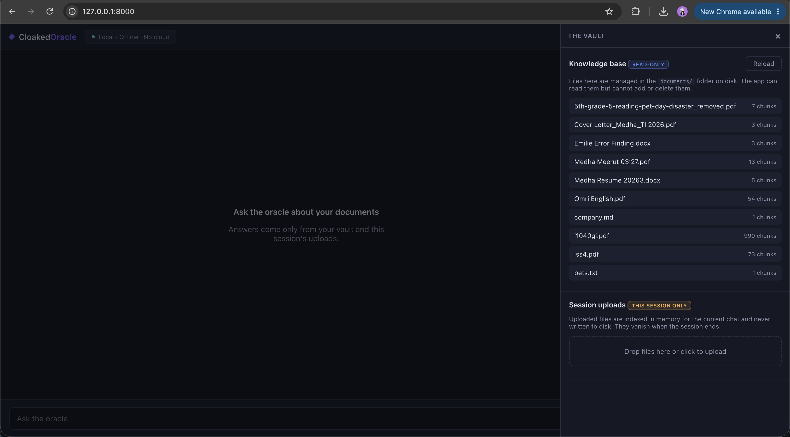
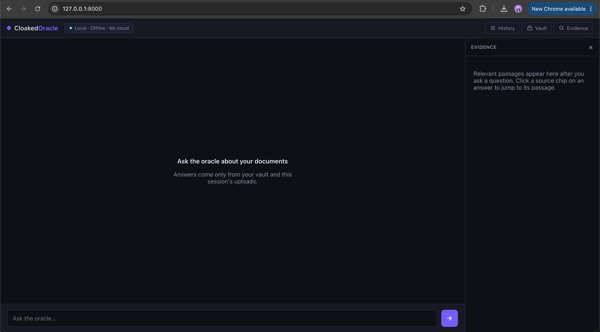

# CloakedOracle

A **privacy-first, fully local AI assistant** with retrieval-augmented generation (RAG).
Nothing leaves your machine: documents are parsed, embedded, and queried entirely
locally, and generation runs through a local [Ollama](https://ollama.com) model. The only
network traffic is to `localhost` (Ollama).

## How it works

- **The vault:** a read-only `documents/` folder is your knowledge base. Put files there
  via the filesystem; CloakedOracle indexes them but can **never write to or delete from
  the folder through the UI**, so your real data stays tamper-proof from the web layer.
- **Session uploads:** you can drag files into the UI for a single chat. These are indexed
  **in memory only**, never written into `documents/`, and are purged when the session ends
  or the server restarts.
- **Grounded answers:** the assistant answers only from the vault + the current session's
  uploads, cites the source files, and shows the relevant retrieved passages in an evidence
  panel (irrelevant matches are filtered out, not just "closest available").

Supported formats: **PDF, `.txt`, `.md`, `.docx`**.

## Screenshots

**Chat** — ask questions, get grounded answers with source citations.


**History** — past chats are tucked into a slide-in drawer so the chat itself is always
front and center.


**Vault** — a read-only view of everything indexed from `documents/`, plus a dropzone for
ephemeral, session-only uploads.



**Evidence** — the exact passages an answer was grounded in, with sources and similarity
scores.



## Installation

You need three things: **Python 3.10+**, **Ollama** (runs the local LLM), and this
project's dependencies. Pick your OS below.

### macOS

1. **Install Ollama and pull a model:**
   ```bash
   brew install ollama          # or download from https://ollama.com/download
   ollama serve                 # leave this running in its own terminal
   ```
   In a second terminal:
   ```bash
   ollama pull llama3.2
   ```
2. **Set up the Python environment** (from the project folder, in a new terminal):
   ```bash
   python3 -m venv .venv
   source .venv/bin/activate
   pip install -r requirements.txt
   ```
   The first install pulls in `torch` + `chromadb` and can take a few minutes.
3. *(optional)* `cp .env.example .env` to customize models/paths.

> Tip: `./setup.sh` automates steps 1–3 (venv, dependencies, `.env`, and the model pull if
> Ollama is already installed). Run `chmod +x setup.sh` once, then `./setup.sh`.

### Windows

1. **Install Ollama:** download and run the installer from
   [ollama.com/download/windows](https://ollama.com/download/windows). It installs Ollama
   as a background service and starts it automatically — you generally don't need to run
   `ollama serve` manually (if it's ever not running, start it from the Start Menu or run
   `ollama serve` in a terminal).
2. **Pull a model** (Command Prompt or PowerShell):
   ```bat
   ollama pull llama3.2
   ```
3. **Set up the Python environment** (from the project folder):

   Command Prompt:
   ```bat
   python -m venv .venv
   .venv\Scripts\activate.bat
   pip install -r requirements.txt
   ```

   PowerShell:
   ```powershell
   python -m venv .venv
   .venv\Scripts\Activate.ps1
   pip install -r requirements.txt
   ```
   If PowerShell blocks the activation script, run it as Administrator once:
   `Set-ExecutionPolicy -Scope CurrentUser RemoteSigned`.
4. *(optional)* copy `.env.example` to `.env` to customize models/paths:
   ```bat
   copy .env.example .env
   ```

> `setup.sh` is a bash script and won't run in Command Prompt/PowerShell. Windows users
> can either follow the manual steps above, or run `setup.sh` from **Git Bash** or **WSL**
> if you have one of those installed.

## Running the app

With Ollama running and the model pulled, and your virtualenv active:

```bash
# put some files in ./documents first (or use the Vault drawer to upload for a session)
uvicorn app.main:app --reload
```

Open **http://localhost:8000**. Add or remove vault files by editing the `documents/`
folder on disk, then click **Reload** in the Vault drawer (or restart the server).

## Configuration

See `.env.example`. Key settings: `LLM_MODEL`, `EMBED_MODEL`, `CHUNK_SIZE`,
`CHUNK_OVERLAP`, `TOP_K`, `MIN_SCORE` (relevance threshold for evidence/sources),
`HISTORY_TURNS`, `MAX_SESSIONS`.

## Layout

```
app/        FastAPI backend (ingest, uploads, retrieval, history, LLM client)
web/        Single-page UI (Chat + History/Vault/Evidence drawers)
documents/  The read-only vault (your knowledge base)
storage/    Chroma vault index + manifest + chat history DB (gitignored)
```
